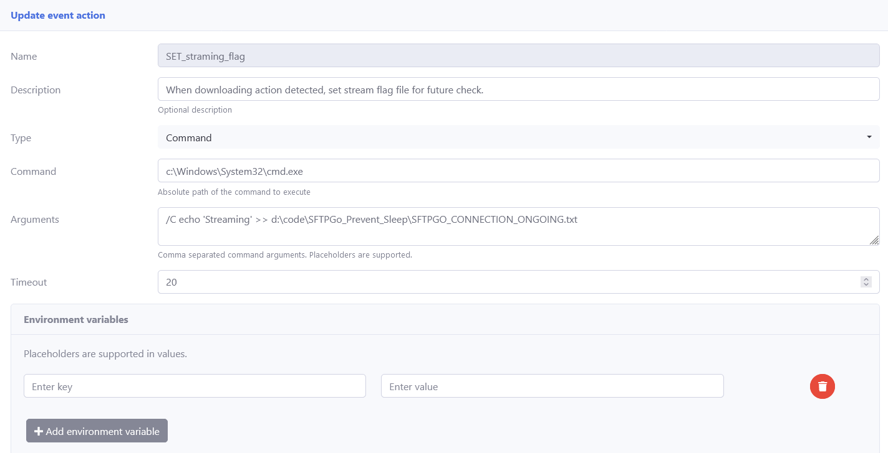
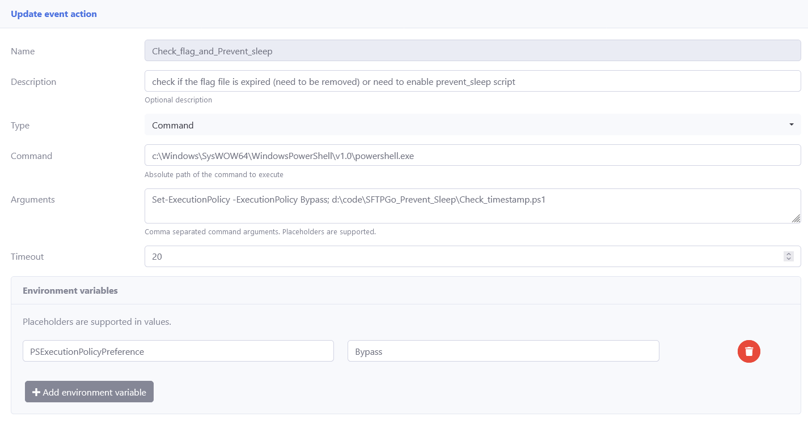
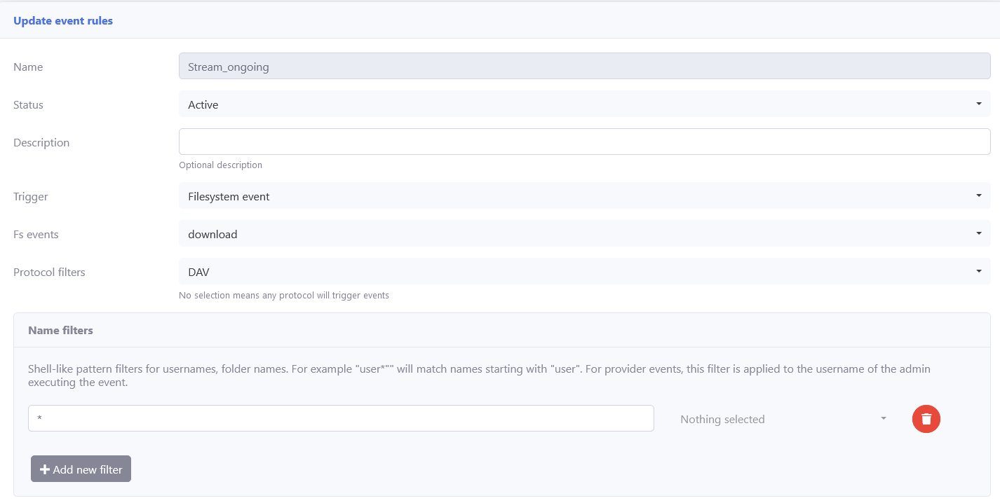
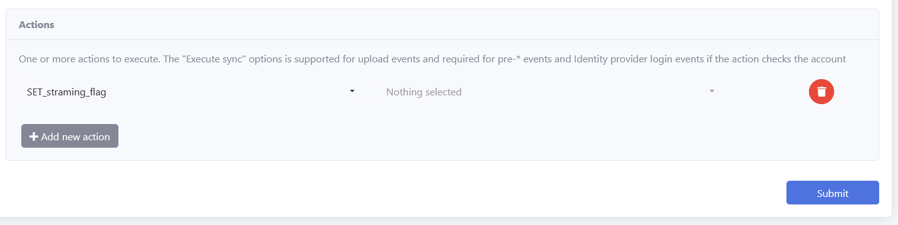

# SFTPGo_Prevent_Sleep
SFTPGo Event action - Keep Windows alive


### Purpose

These scripts are used for keep windows 11 alive while serving the content to remote player (aka Kodi in my case).

### Requirement

- [SFTPGo](https://sftpgo.com/) installed
- PowerShell installed (should shipped with Windows)

### Installation
1. Copy the scripts to your harddrive (eg: d:\code\SFTPGo_Prevent_Sleep\)
2. Setup SFTPGo Event actions in SFTPGo WebAdmin -> Event Manager -> Event actions.


> **Note**: After 2.6.3, the command option is disable by default in Event action list.
> 
> You must enable it in the configuration file (ie. c:\ProgramData\SFTPGo\sftpgo.json).
> 
> Look for the event_manager section and find "enable_commands", and then add your command.
> 
> example:
>
> ```
>     "event_manager": {
>	 "enabled_commands": ["c:\\Windows\\System32\\cmd.exe","c:\\Windows\\SysWOW64\\WindowsPowerShell\\v1.0\\powershell.exe"]
>    }
>
>```    
>
> Rememeber to restart the service using the following commands:
> ```
> c:\Program Files\SFTPGo>sftpgo service stop
> c:\Program Files\SFTPGo>sftpgo service start
> ```
> 
> After that, you should be able to find command as an option in Type list.


   You can refer the following screenshots for setting the Command and Arguments fields.
   
> for SET_straming_flag:
> 
> Arguments: /C echo 'Streaming' >> d:\code\SFTPGo_Prevent_Sleep\SFTPGO_CONNECTION_ONGOING.txt
> 
   
   

> for Check_flag_and_Prevent_sleep:
> 
> Arguments: Set-ExecutionPolicy -ExecutionPolicy Bypass; d:\code\SFTPGo_Prevent_Sleep\Check_timestamp.ps1
>

   
   
3. Setup SFTPGo Event rules in SFTPGo WebAdmin -> Event Manager -> Event rules.   

	3.1: Setup an event triggered when serving the contents (aka. Fs events download), actions link to SET_stream_flag as shown in step 2.
      	
   	


	3.2: Setup an event  in Windows Task Scheduler (工作排程器) , executing the corresponding action (Check_flag_and_Prevent_sleep) per hour.
   

3. The minimum schedule interval of SFTPGo is 1 hour. so it is better to make the Windows idle time (before entering the sleep/standby) larger then 1 hour.

### Debug
If everything goes well, you shall find:
- After starting serving the contents (download begin), the timestamp flag (SFTPGO_CONNECTION_ONGOING.txt) was created and the file modified time is updated.
- After scheduled time (default begin of every hour), the Powershell script will be executed. You can check if the "prevent sleep" is effective by checking executeing the following command under cmd (adminstrater mode needed)
```
powercfg /requests
```
- you can also check some details by manually executing the following command under cmd:
```
powershell Check_timestamp.ps1
```

- It is also a good way to review your sleep/wake history by the following command:
```
powercfg /sleepstudy
```

### References:
The tool is my first Powershell script and inspired by the following howtos:

- ##### Keeping Windows Awake (with PowerShell)
	https://blog.backslasher.net/windows-awake-ps.html

- ##### date/time comparison:
	https://www.sharepointdiary.com/2020/08/compare-dates-in-powershell.html

- ##### check file exist
	https://www.sharepointdiary.com/2020/08/powershell-check-if-file-exists.html

- ##### PowerShell Sleep: A Guide to Pause Scripts with Start-Sleep Command 
	https://www.sharepointdiary.com/2020/09/powershell-sleep-command.html


- ##### How to Round Decimal Numbers in PowerShell?
	https://www.sharepointdiary.com/2020/10/round-decimal-numbers-in-powershell.html

- ##### discussing start-process 
	https://lazyadmin.nl/powershell/start-process/

- ##### Get-ExecutionPolicy
	https://ithelp.ithome.com.tw/m/articles/10028377

 
